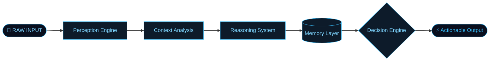
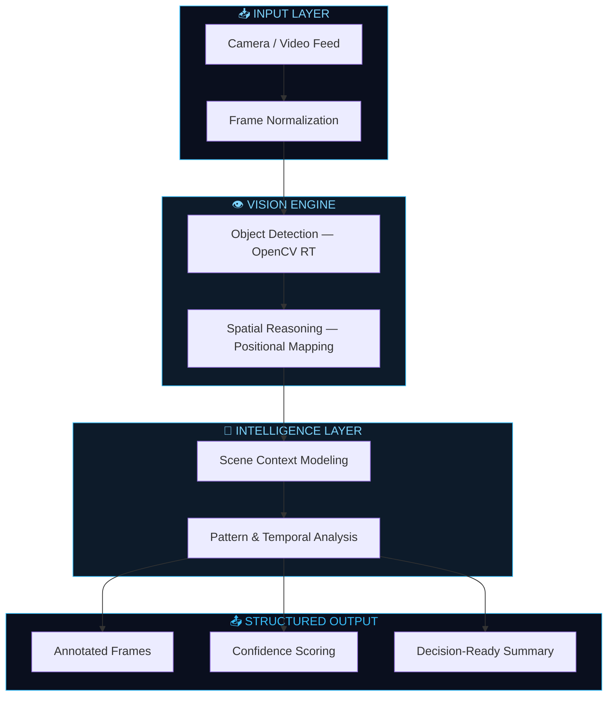
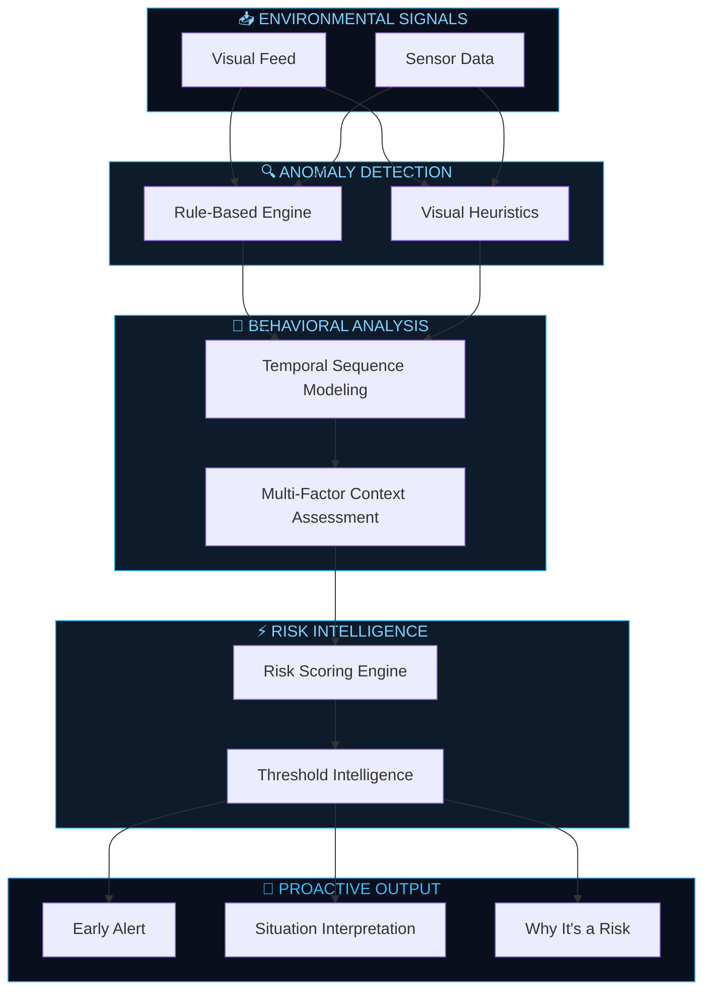
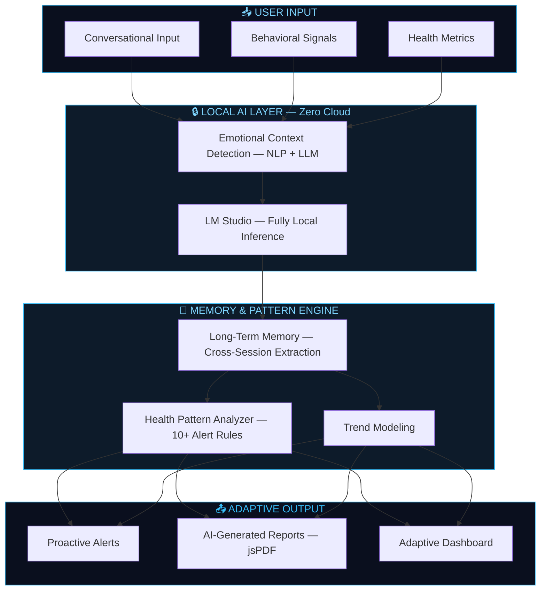

<p align="center">
  
</p>

<p align="center">
  
</p>

<p align="center">
  
  &nbsp;
  
  &nbsp;
  
  &nbsp;
  
</p>


## `// SYSTEM PROFILE`

<table width="100%">
<tr>
<td valign="top" width="60%">

```python
class JagrutJoshi:
    name       = "Jagrut Joshi"
    role       = "AI Systems Engineer"
    university = "DY Patil International University, Pune"

    builds = [
        "Intelligent perception systems (vision + contextual reasoning)",
        "Safety & anomaly detection with behavioral awareness",
        "Human-centric AI with emotional context & long-term memory",
    ]

    principles = [
        "Systems  >  Models",
        "Context  >  Detection",
        "Decision >  Prediction",
        "Local AI >  Cloud dependency",
    ]

    stack = {
        "ai_ml"   : ["scikit-learn", "OpenCV", "LM Studio", "OpenAI API"],
        "data"    : ["NumPy", "Pandas", "Matplotlib", "Seaborn"],
        "systems" : ["Python", "Java", "C", "JavaScript"],
        "tools"   : ["Git", "VS Code", "Jupyter", "Linux"],
    }

    motto = "Intelligence is not prediction. It is decision-making."
```

</td>
<td valign="top" align="center" width="40%">


**`[ SYSTEM ONLINE ]`**

`📍` Pune, India &nbsp;·&nbsp; `🕐` UTC+5:30

`🎯` Computer Vision · Local LLM · Edge AI

`⚡` Perception → Reasoning → Action

</td>
</tr>
</table>


## `// ENGINEERING PHILOSOPHY`

<div align="center">
<table>
<tr>
<td align="center" width="20%">

**`🧠 SYSTEMS`**

Full pipelines<br/>Input → Reasoning → Output<br/><sub>Not isolated models</sub>

</td>
<td align="center" width="20%">

**`🔍 CONTEXT`**

Interprets environments<br/>Doesn't just scan them<br/><sub>Not object labeling</sub>

</td>
<td align="center" width="20%">

**`⚡ DECISION`**

Actionable intelligence<br/>Ready to act on<br/><sub>Not probability scores</sub>

</td>
<td align="center" width="20%">

**`🔐 PRIVACY`**

All intelligence on-device<br/>Zero cloud exposure<br/><sub>Not cloud-dependent</sub>

</td>
<td align="center" width="20%">

**`🌍 IMPACT`**

Real-world deployability<br/>Ships to production<br/><sub>Not benchmark metrics</sub>

</td>
</tr>
</table>
</div>


## `// ARCHITECTURE THINKING`

> How I think about every system I build — from input to actionable output.




## `// AI SYSTEMS PORTFOLIO`

> **Three systems. One philosophy — Intelligence that perceives, reasons, and acts.**

---

### `[ 01 ]` &nbsp;👁️&nbsp; NeuroVision AI — Intelligent Perception System

> *From detection to understanding. Vision that knows what it sees.*

<details>
<summary><b>&nbsp;▶&nbsp; Architecture · Intelligence Layer · Deployment</b></summary>

<br/>

**Problem** &nbsp;— Vision systems detect. They don't *interpret*. Standard CV answers *"What is here?"* — incomplete for real-world deployment.

**Gap Solved** &nbsp;— Detection asks *"What is here?"* &nbsp;|&nbsp; NeuroVision answers **"What is happening — and why does it matter?"**

**System Pipeline**



**Intelligence Layer**

| Capability | Implementation | Signal |
|---|---|---|
| Object Detection | OpenCV · Real-time | Live visual pipeline |
| Scene Understanding | Spatial reasoning · Pattern analysis | Environment-aware context |
| Structured Output | Annotated frames · Confidence scoring | Decision-ready data |
| Temporal Continuity | Frame-by-frame state tracking | Understands change over time |

**Deployment Vision** &nbsp;·&nbsp; `Urban Monitoring` &nbsp;·&nbsp; `Smart Infrastructure` &nbsp;·&nbsp; `Situational Analysis`

<br/>

</details>

---

### `[ 02 ]` &nbsp;🛡️&nbsp; SafeNet AI — Proactive Safety Intelligence System

> *Reactive monitoring isn't safety. SafeNet predicts risk before it escalates.*

<details>
<summary><b>&nbsp;▶&nbsp; Architecture · Intelligence Layer · Deployment</b></summary>

<br/>

**Problem** &nbsp;— Safety systems alert *after* breach. In high-stakes environments, that latency is already a failure.

**Gap Solved** &nbsp;— Alerts say *"Something went wrong."* &nbsp;|&nbsp; SafeNet says **"Something is about to go wrong — here's when and why."**

**System Pipeline**



**Intelligence Layer**

| Capability | Implementation | Signal |
|---|---|---|
| Anomaly Detection | Rule-based + visual heuristics | Context-aware flagging |
| Behavioral Recognition | Temporal sequence analysis | Tracks pattern evolution |
| Risk Scoring | Threshold intelligence engine | Predicts — doesn't react |
| Situation Interpretation | Multi-factor scene assessment | Explains *why* it's a risk |

**Deployment Vision** &nbsp;·&nbsp; `Public Spaces` &nbsp;·&nbsp; `Industrial Safety` &nbsp;·&nbsp; `Critical Infrastructure`

<br/>

</details>

---

### `[ 03 ]` &nbsp;🧬&nbsp; NeuroWell — Health Intelligence System

> *Health data without context is noise. NeuroWell builds understanding over time.*

<details>
<summary><b>&nbsp;▶&nbsp; Architecture · Intelligence Layer · Deployment</b></summary>

<br/>

**Problem** &nbsp;— Health apps log data. They don't notice patterns, remember sessions, or build understanding. Every conversation starts from zero.

**Gap Solved** &nbsp;— Logs say *"What happened today?"* &nbsp;|&nbsp; NeuroWell says **"What is happening to you over time — and what does it mean?"**

**System Pipeline**



**Intelligence Layer**

| Capability | Implementation | Signal |
|---|---|---|
| Conversational AI | Local LLM via LM Studio | Fully private · Zero cloud |
| Long-term Memory | Cross-session pattern extraction | Knows your full history |
| Emotional Intelligence | Heuristic NLP + LLM classification | Affective context, not just vitals |
| Health Pattern Detection | 10+ intelligent alert rules | Catches behavioral anomalies |
| Automated Reports | jsPDF · AI-generated narrative | Synthesizes patterns into insight |
| PWA + Offline | Service Worker · Installable | Production-grade edge deployment |

**Deployment Vision** &nbsp;·&nbsp; `Personal Health Awareness` &nbsp;·&nbsp; `Preventive Care` &nbsp;·&nbsp; `Privacy-First Health AI`

<br/>

</details>

---


## `// SYSTEM IMPACT`

<div align="center">

| Domain | System Built | Why It Matters |
|---|---|---|
| 👁️ Visual Intelligence | Scene-aware perception pipeline | Vision beyond detection |
| 🛡️ Safety Systems | Proactive anomaly + behavioral prediction | Predicts risk before it escalates |
| 🧬 Health AI | Conversational AI with long-term memory | Builds understanding, not logs |
| 🔒 Privacy-First AI | Fully local LLM deployment | Production AI · Zero cloud exposure |
| 🏗️ Automation | Ticket management · Document generation | Automated decision-support workflows |

</div>


## `// TECHNOLOGY STACK`

<div align="center">

**AI · ML · Vision**


&nbsp;
&nbsp;
&nbsp;

**Data · Analysis**


&nbsp;
&nbsp;
&nbsp;

**Languages · Tools · Deployment**


</div>


## `// AI ENGINEERING MINDSET`

<div align="center">

```
  Most AI projects optimize for demo performance.
  I optimize for real-world decision quality.

  A system that scores 94% on a benchmark and fails in production
  is not a system. It is a prototype.

  I build pipelines that handle ambiguity, noise,
  edge cases, and the messiness of the real world.
```

</div>


## `// RESEARCH INTERESTS`

<div align="center">


&nbsp;


&nbsp;


&nbsp;


</div>


## `// CURRENT FOCUS`

<div align="center">


</div>


## `// GITHUB INTELLIGENCE DASHBOARD`

<div align="center">

<!-- ROW 1: GitHub Stats + Top Languages — equal height, side by side -->
<table width="100%">
<tr>
<td align="center" width="50%">

</td>
<td align="center" width="50%">

</td>
</tr>
</table>

<!-- ROW 2: Streak — full width -->


<!-- ROW 3: Contribution Activity Graph — full width -->


<!-- ROW 4: Summary Cards — three compact cards -->
<table width="100%">
<tr>
<td align="center" width="33%">

</td>
<td align="center" width="33%">

</td>
<td align="center" width="33%">

</td>
</tr>
</table>

<!-- ROW 5: Contribution Snake -->
<picture>
  <source media="(prefers-color-scheme: dark)" srcset="https://raw.githubusercontent.com/Jags-08/Jags-08/output/github-contribution-grid-snake-dark.svg"/>
  <source media="(prefers-color-scheme: light)" srcset="https://raw.githubusercontent.com/Jags-08/Jags-08/output/github-contribution-grid-snake.svg"/>
  
</picture>

</div>


## `// ENGINEERING ROADMAP`

```mermaid
flowchart LR
    subgraph Done["✅ COMPLETED"]
        A[Full-Stack AI Systems]
        B[Local LLM Deployment]
        C[Safety & Perception Pipelines]
    end

    subgraph Active["🔄 IN PROGRESS"]
        D[NeuroVision — Multi-Context Scale]
        E[SafeNet — Edge Hardware Deploy]
        F[AI Systems Internship]
    end

    subgraph Next["⬜ NEXT"]
        G[Unified Vision + NLP Pipeline]
        H[Research Publication]
        I[Cloud ML Certification]
    end

    Done --> Active --> Next

    style Done fill:#0a2a1a,stroke:#22c55e,color:#86efac
    style Active fill:#0a1a2a,stroke:#38BDF8,color:#7DD3FC
    style Next fill:#1a1a2a,stroke:#6366f1,color:#a5b4fc
```




## `// CONTRIBUTION PHILOSOPHY`

<div align="center">

```
  Every commit is a decision.
  Every PR is a system change.
  Every repo is an argument for how intelligence should work.

  I don't push code. I push reasoning.
```

</div>


## `// CONNECT`

<div align="center">

<a href="https://github.com/Jags-08">
  
</a>
&nbsp;
<a href="https://www.linkedin.com/in/joshi-jagrut/">
  
</a>
&nbsp;
<a href="mailto:jagrutjoshi02@gmail.com">
  
</a>

<br/>

**`Available for:`** &nbsp; ML/AI Internships &nbsp;`·`&nbsp; AI Systems Collaboration &nbsp;`·`&nbsp; Computer Vision Projects &nbsp;`·`&nbsp; Open Source

<br/>


> *"I don't build models. I build systems that see, understand, and act."*

</div>


